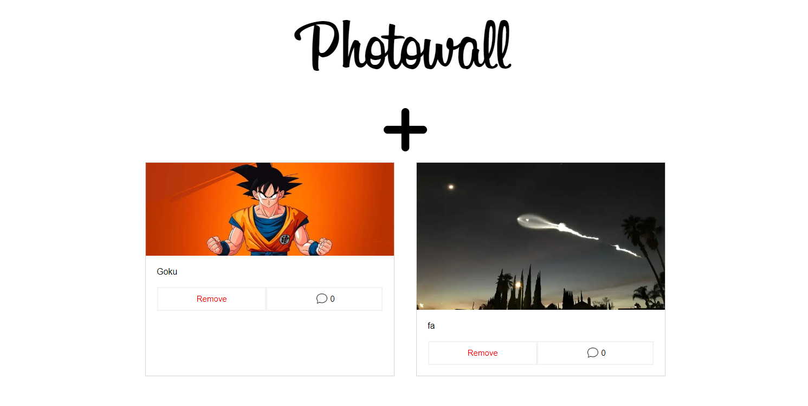
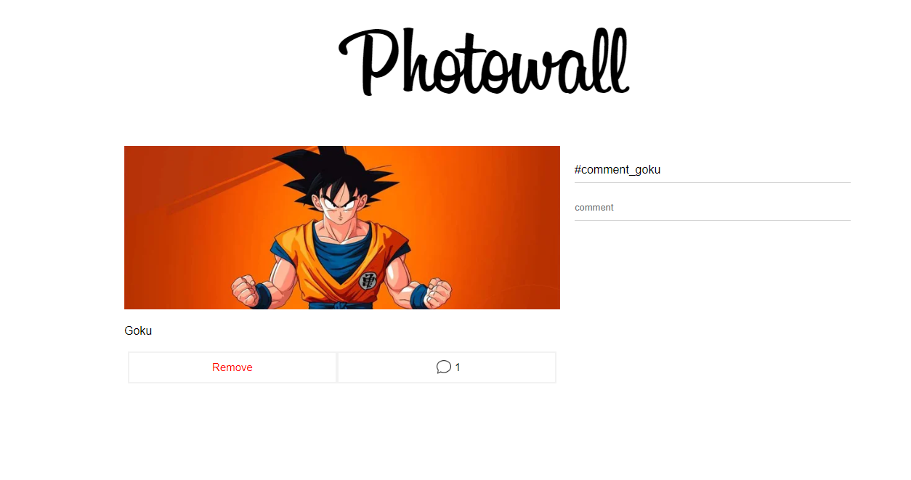

# PhotoWall Project using ReactJs, Redux and Firebase

In this project I've learned the fundamentals and the advanced concepts of ReactJs.
For this project I choose use the class components instead using the function components
and Hooks to learn how things were made with the old versions. I'll update this code in the
future to use Hooks and function components.

I've also used "react-router-dom" for routing, applied redux to manage the state of the application, 
and using the Realtime Database from firebase to store the data persistenly. 

# Dashboard Photos

# Comment session

